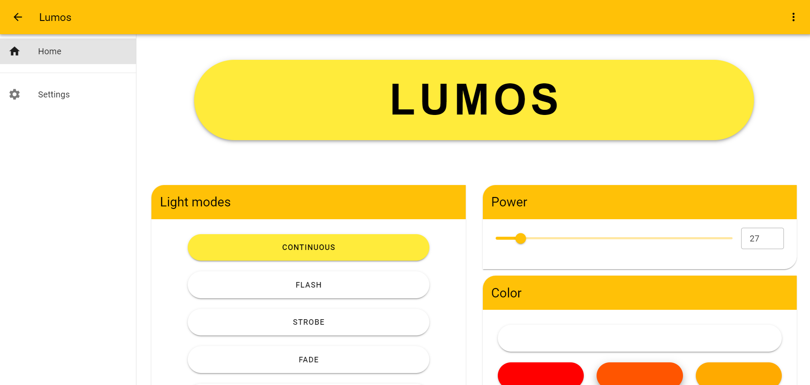

# Lumos

This is a personnal project to create a fully automated alarm clock.

This would wake you up using a smooth light that can also be completed with sound.

This project uses an `ESP32` as its main processor.

The application is made using `Visual Studio Code` with the `PlatformIO` plugin. You can use an IDE other than `Visual Studio Code` but `PlatformIO` is needed.

You will need to change the `debugPort` variable in the `platformio.ini` file.
